# Welcome to Expense Tracking App

Welcome to the Expense Tracker App! This app is designed to help users efficiently track and manage their expenses, ensuring better control over personal finances.

## Features
 
### Welcome Screen 

#### Images

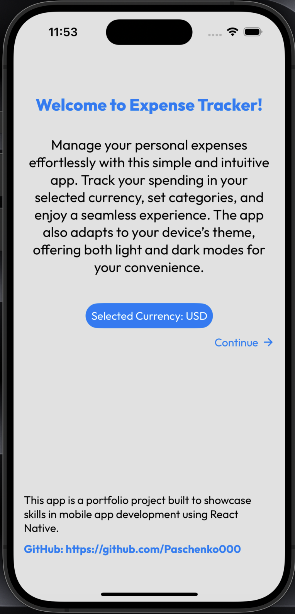 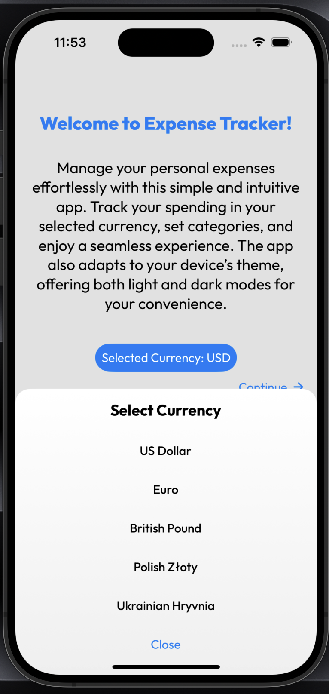
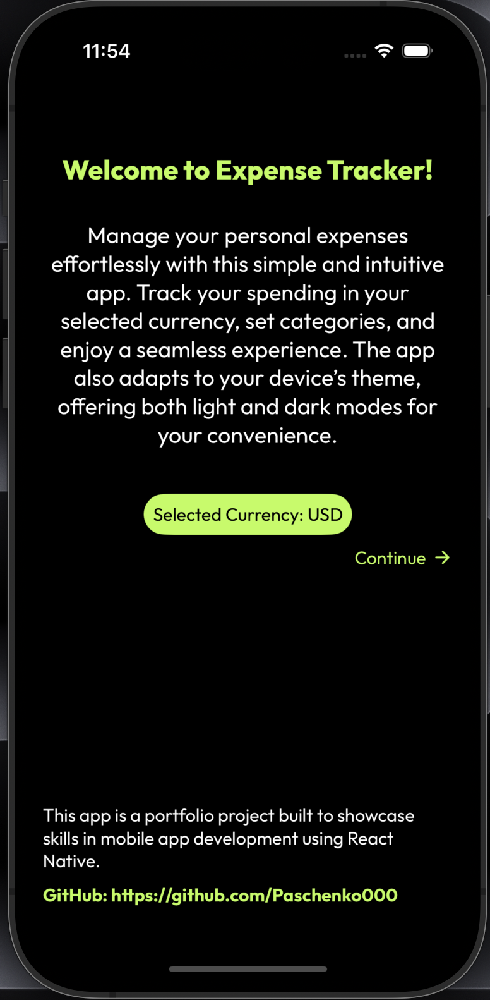 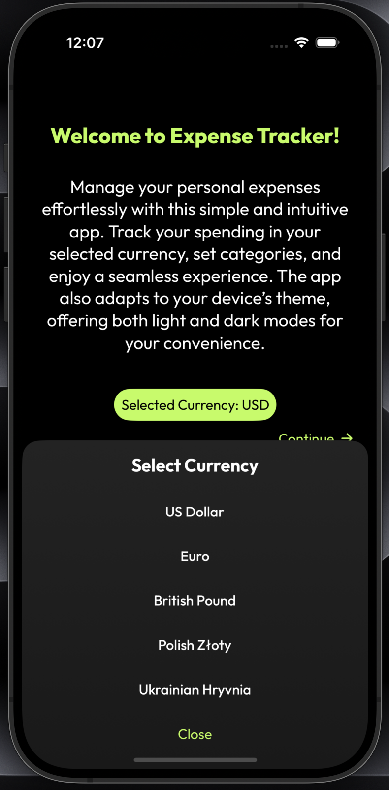

- Select your preferred currency on the welcome screen (this cannot be changed later in the app).

### All Expenses Screen

#### Images

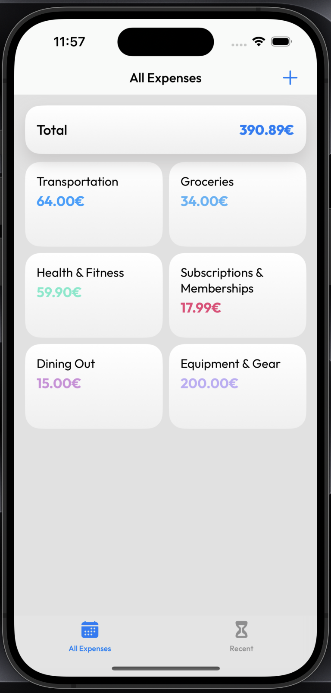 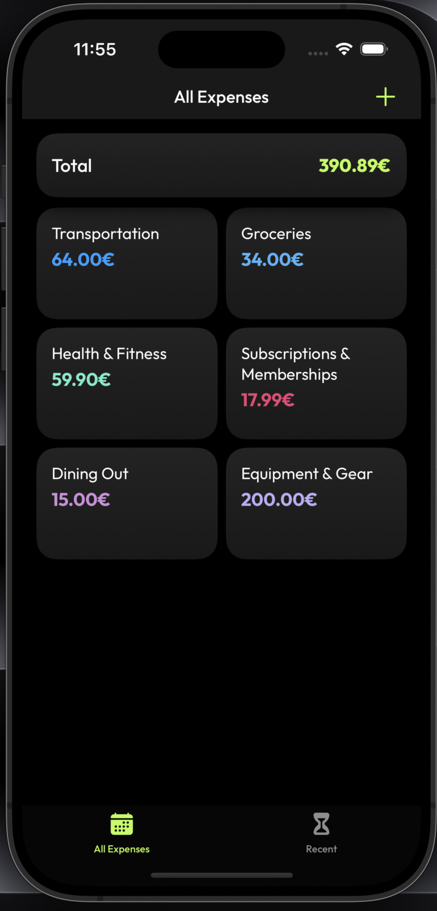

- View all registered expenses organized by categories.
- Tap on a category to see detailed expenses specific to that category.
- Add a new expense by tapping the "+" button.

### Category Expenses Screen

#### Images

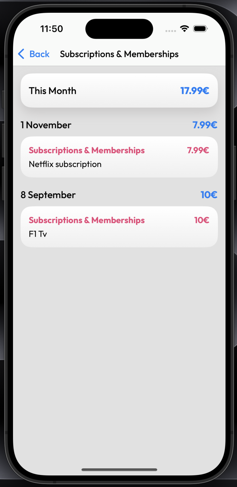 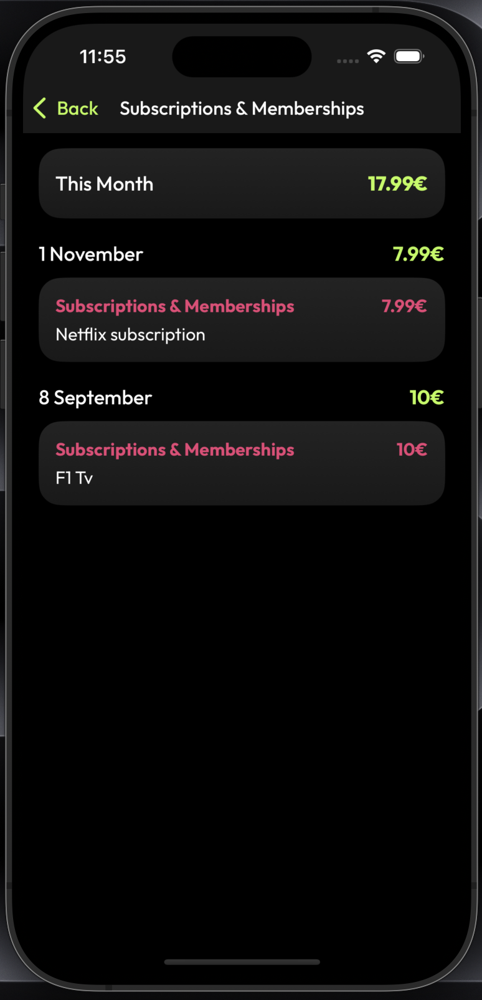

- View all expenses for a specific category.
- Tap on an expense to navigate to the Manage Expense Screen, where you can:
  - Update the details of the selected expense.
  - Delete the expense.

###  Recent Expenses Screen

#### Images

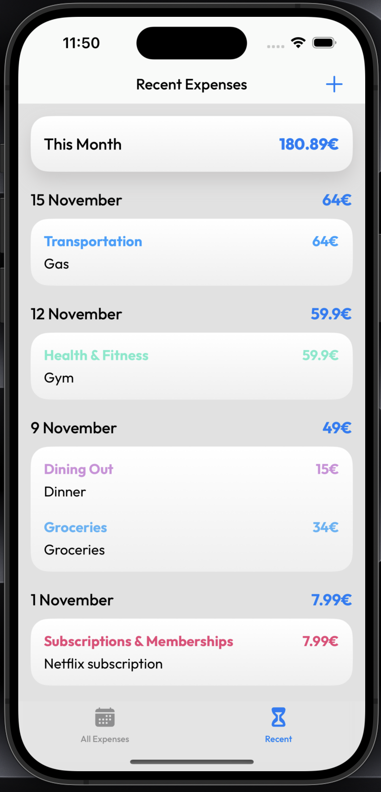 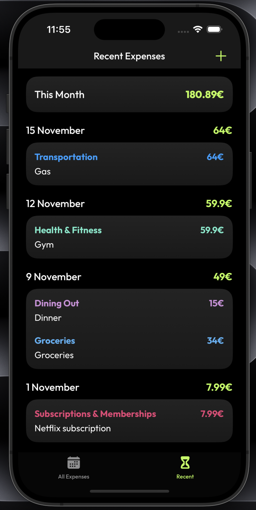

- View all expenses from the current month, grouped by date for better clarity.
- Tap on an expense to navigate to the Manage Expense Screen, where you can:
  - Update the details of the selected expense.
  - Delete the expense.

### Manage Expense Screen

#### Images

Edit Expense

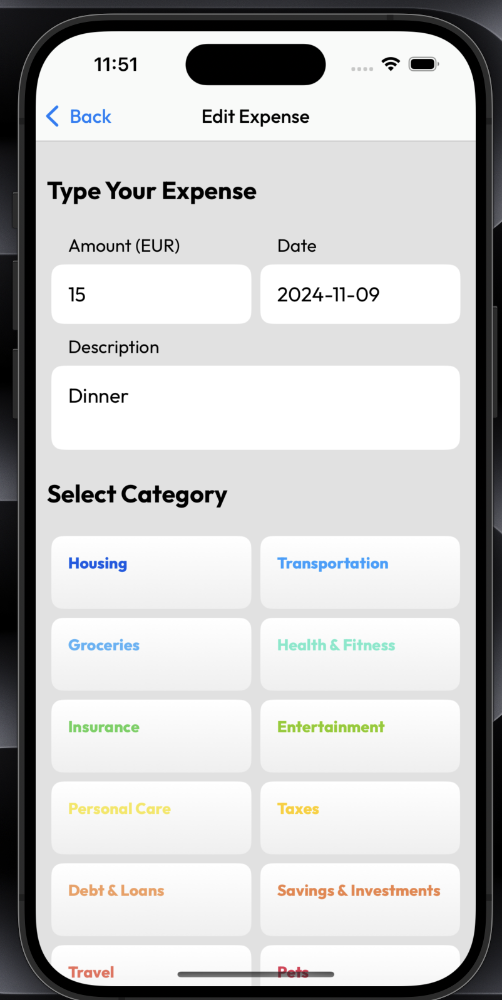 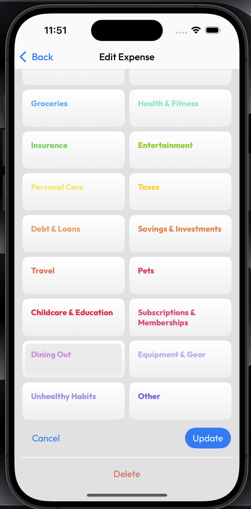
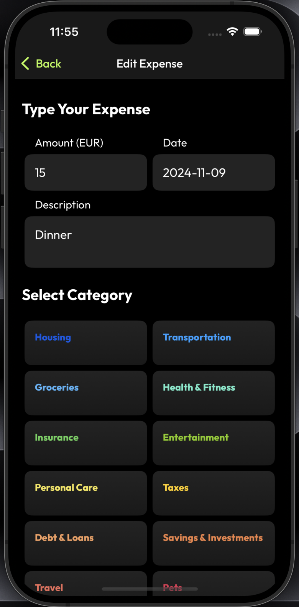 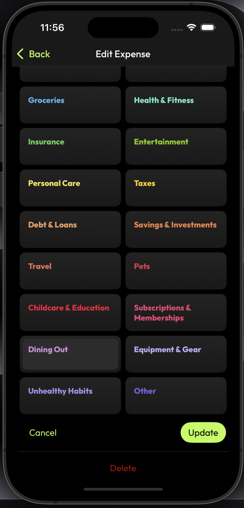

Add Expense

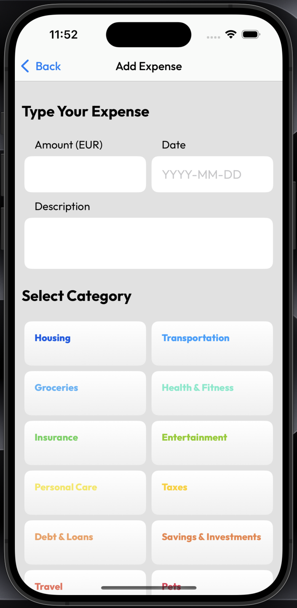 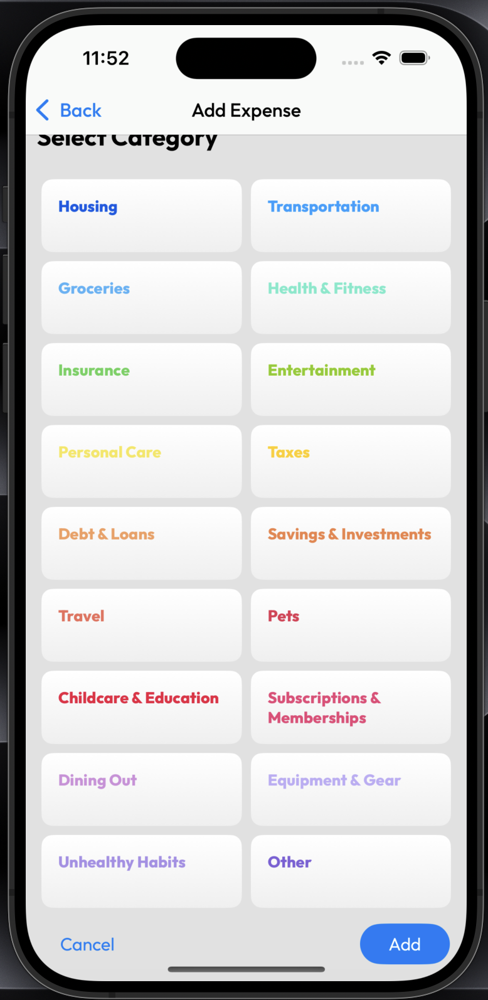
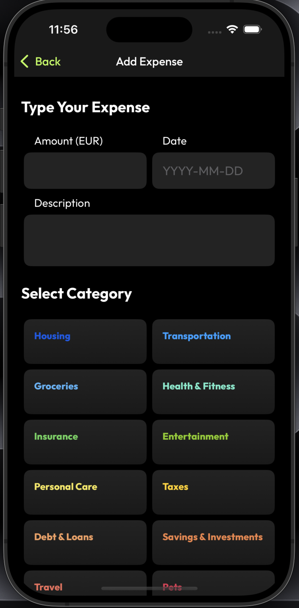 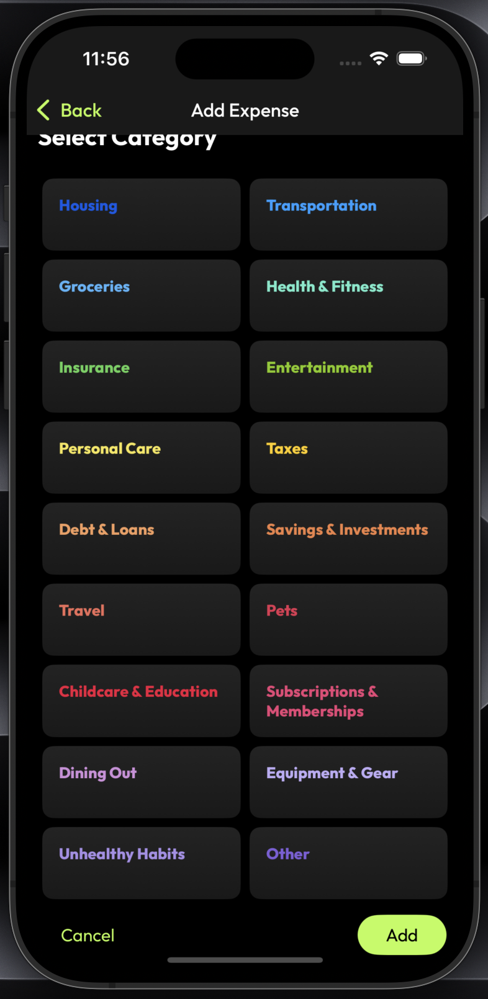

- Add a new expense using the plus button located on the top-right corner of the All Expenses and Recent Expenses screens.
- Update or delete existing expenses from this screen.

## Key Technologies Used

- [Expo](https://docs.expo.dev/more/expo-cli/): A framework for building React Native apps quickly and efficiently.
- [useContext](https://react.dev/reference/react/useContext): For seamless state management across the app.
- [MMKV](https://www.npmjs.com/package/react-native-mmkv): A lightweight and fast storage solution for storing expense data locally.
- [Theming](https://docs.expo.dev/develop/user-interface/color-themes/): Supports both dark and light themes for an improved user experience.
- [Outfit Font](https://fonts.google.com/specimen/Outfit): For a modern and clean typography style.

## Get started

1. Install dependencies

   ```bash
   npm install
   ```

2. Start the app

   ```bash
    npx expo run
   ```

In the output, you'll find options to open the app in a

- [development build](https://docs.expo.dev/develop/development-builds/introduction/)
- [Android emulator](https://docs.expo.dev/workflow/android-studio-emulator/)
- [iOS simulator](https://docs.expo.dev/workflow/ios-simulator/)
- [Expo Go](https://expo.dev/go), a limited sandbox for trying out app development with Expo

You can start developing by editing the files inside the **app** directory. This project uses [file-based routing](https://docs.expo.dev/router/introduction).

## Get a fresh project

When you're ready, run:

```bash
npm run reset-project
```

This command will move the starter code to the **app-example** directory and create a blank **app** directory where you can start developing.

## Learn more

To learn more about developing your project with Expo, look at the following resources:

- [Expo documentation](https://docs.expo.dev/): Learn fundamentals, or go into advanced topics with our [guides](https://docs.expo.dev/guides).
- [Learn Expo tutorial](https://docs.expo.dev/tutorial/introduction/): Follow a step-by-step tutorial where you'll create a project that runs on Android, iOS, and the web.

## Join the community

Join our community of developers creating universal apps.

- [Expo on GitHub](https://github.com/expo/expo): View our open source platform and contribute.
- [Discord community](https://chat.expo.dev): Chat with Expo users and ask questions.
